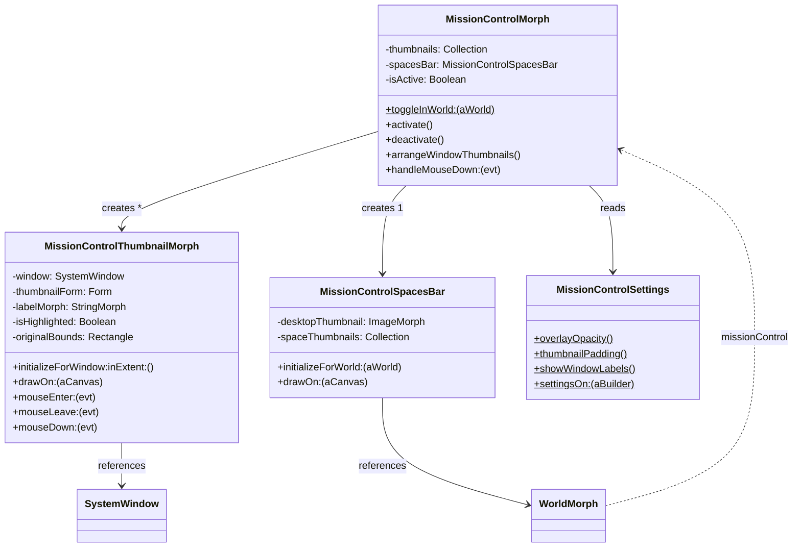

# Mission Control for Pharo

Implement a macOS-style "Mission Control" feature in Pharo's Morphic framework. When activated, Mission Control shows all open windows on the desktop arranged as scaled-down thumbnails in a single layer on a darkened overlay, making it easy to spot and switch to the one you need. A "Spaces bar" along the top edge shows thumbnails for collapsed/minimized windows and the desktop itself.

## User Review Required

> [!IMPORTANT]
> **Keyboard Shortcut**: The plan uses `Ctrl+Up` (or `Cmd+Up` on macOS) to toggle Mission Control, which is consistent with macOS. Should a different shortcut be used? Note that `F3` is the alternative macOS shortcut — we could bind both.

> [!IMPORTANT]
> **Animation**: The initial implementation will use a simple fade-in/out for entering/exiting Mission Control. Should we implement animated scaling (windows zooming out to their thumbnail positions), or is the simple approach sufficient for V1?

> [!WARNING]
> **Performance**: Generating thumbnails for many windows (20+) could be slow on large displays. The plan uses `Morph>>asFormOfSize:` (the same approach as the existing taskbar preview) and defers rendering. Is this acceptable, or should we explore lazy/on-demand thumbnail generation?

## Open Questions

1. **Scoping**: Should Mission Control show *only* `SystemWindow` instances, or also non-window submorphs of the World (e.g., standalone morphs, inspectors opened via halo)?
2. **Desktop spaces**: macOS Mission Control shows multiple "Spaces" (virtual desktops). Pharo currently has no concept of virtual desktops. Should we add a minimal virtual-desktop system as part of this feature, or defer that to a future iteration and focus only on the "show all windows" view?
3. **Package name**: The plan proposes `Morphic-Widgets-MissionControl`. Is that consistent with your naming conventions, or would you prefer something like `Morphic-MissionControl` or `MorphicMissionControl`?

## Proposed Changes

### New Package: `Morphic-Widgets-MissionControl`

This package contains all Mission Control classes and is self-contained, adding only extension methods to existing classes for integration.

---

#### [NEW] [MissionControlMorph.class.st](file:///Users/fede/Documents/PhD/pharo/src/Morphic-Widgets-MissionControl/MissionControlMorph.class.st)

The central overlay morph that covers the entire world when Mission Control is activated.

**Class definition:**
```smalltalk
Class {
    #name : 'MissionControlMorph',
    #superclass : 'Morph',
    #instVars : [
        'thumbnails',
        'spacesBar',
        'isActive'
    ],
    #classVars : [
        'ShowMissionControl'
    ],
    #category : 'Morphic-Widgets-MissionControl',
    #package : 'Morphic-Widgets-MissionControl'
}
```

**Key responsibilities:**
- **`toggleInWorld:`** — Class-side method. If Mission Control is already showing, dismiss it; otherwise, create a new one and display it. This is the single entry point.
- **`activate`** — Collects all `SystemWindow` instances from the world (using `world windowsSatisfying:` or `world systemWindows`), creates a `MissionControlThumbnailMorph` for each, arranges them using a grid layout algorithm, creates the `MissionControlSpacesBar`, adds a semi-transparent dark background overlay, and opens in the world as the topmost morph.
- **`deactivate`** — Removes itself from the world, bringing the selected window to front if one was clicked.
- **`arrangeWindowThumbnails`** — Layout algorithm: scales each window thumbnail proportionally to fit within a grid that fills the available screen area (below the spaces bar). Windows are arranged left-to-right, top-to-bottom, maintaining their aspect ratio. Uses a bin-packing approach similar to macOS: windows keep relative positions but are scaled down.
- **`handleMouseDown:`** — If the click hits a thumbnail, deactivate and activate that window. If the click hits the background (no thumbnail), deactivate and return to the desktop.
- **`handleKeyStroke:`** — Pressing Escape or the activation shortcut again dismisses Mission Control.
- **`morphicLayerNumber`** — Returns a very low number (e.g., `1`) to ensure it renders above everything, including the taskbar.
- **`wantsToBeTopmost`** — Returns `true`.
- **`drawOn:`** — Draws a semi-transparent dark overlay (`Color black alpha: 0.5`) filling the world bounds.

---

#### [NEW] [MissionControlThumbnailMorph.class.st](file:///Users/fede/Documents/PhD/pharo/src/Morphic-Widgets-MissionControl/MissionControlThumbnailMorph.class.st)

A morph representing a single window's thumbnail within Mission Control.

**Class definition:**
```smalltalk
Class {
    #name : 'MissionControlThumbnailMorph',
    #superclass : 'BorderedMorph',
    #instVars : [
        'window',
        'thumbnailForm',
        'labelMorph',
        'isHighlighted',
        'originalBounds'
    ],
    #category : 'Morphic-Widgets-MissionControl',
    #package : 'Morphic-Widgets-MissionControl'
}
```

**Key responsibilities:**
- **`initializeForWindow:inExtent:`** — Takes a `SystemWindow` and a target extent. Generates a thumbnail of the window using `window taskThumbnailOfSize:` (reusing the existing taskbar thumbnail mechanism which handles minimized windows correctly). Stores the `originalBounds` for the window (used for relative positioning). Creates a label showing the window title.
- **`drawOn:`** — Draws a rounded-corner frame with a subtle shadow, the window thumbnail image inside it, and the window title below. Highlights (brighter border/glow) when `isHighlighted` is true.
- **`mouseEnter:`** / **`mouseLeave:`** — Toggle `isHighlighted` and redraw with visual feedback (e.g., slight scale-up, border glow).
- **`mouseDown:`** — Tells the owning `MissionControlMorph` to deactivate and switch to this window.
- **`window`** — Accessor for the underlying `SystemWindow`.

---

#### [NEW] [MissionControlSpacesBar.class.st](file:///Users/fede/Documents/PhD/pharo/src/Morphic-Widgets-MissionControl/MissionControlSpacesBar.class.st)

A horizontal bar along the top edge of the screen showing the desktop and any collapsed/minimized windows as small thumbnails (analogous to the macOS Spaces bar).

**Class definition:**
```smalltalk
Class {
    #name : 'MissionControlSpacesBar',
    #superclass : 'BorderedMorph',
    #instVars : [
        'desktopThumbnail',
        'spaceThumbnails'
    ],
    #category : 'Morphic-Widgets-MissionControl',
    #package : 'Morphic-Widgets-MissionControl'
}
```

**Key responsibilities:**
- **`initializeForWorld:`** — Creates a horizontal layout bar at the top of the screen. Adds a small thumbnail of the entire desktop (world). Also adds thumbnails for each minimized/collapsed window as separate "spaces".
- **`drawOn:`** — Draws a translucent dark bar background with the thumbnails inside.
- **`mouseDown:`** — Click on the desktop thumbnail to deactivate Mission Control and return to the desktop. Click on a space to activate that collapsed window.
- Uses `TableLayout` with `#leftToRight` direction and center alignment.

---

#### [NEW] [MissionControlSettings.class.st](file:///Users/fede/Documents/PhD/pharo/src/Morphic-Widgets-MissionControl/MissionControlSettings.class.st)

Settings for Mission Control, exposed in the Settings Browser.

```smalltalk
Class {
    #name : 'MissionControlSettings',
    #superclass : 'Object',
    #classVars : [
        'OverlayOpacity',
        'ThumbnailPadding',
        'ShowWindowLabels',
        'AnimateTransitions'
    ],
    #category : 'Morphic-Widgets-MissionControl',
    #package : 'Morphic-Widgets-MissionControl'
}
```

**Key responsibilities:**
- Class-side accessors for overlay opacity (default `0.5`), thumbnail padding (default `20`), label visibility (default `true`), animation (default `false`).
- **`settingsOn:`** — Pragma `<systemsettings>` method to register these in the Settings Browser under the `morphic` parent category.

---

#### [NEW] [package.st](file:///Users/fede/Documents/PhD/pharo/src/Morphic-Widgets-MissionControl/package.st)

Package declaration file.

---

### Existing Class Extensions

---

#### [MODIFY] [WorldState.extension.st](file:///Users/fede/Documents/PhD/pharo/src/Morphic-Base/WorldState.extension.st)

Add a "Mission Control" item to the **Windows** world menu (around line 199–224).

```diff
 (aBuilder item: #Windows)
     order: 90;
     with: [
+        (aBuilder item: #'Mission Control')
+            action: [ MissionControlMorph toggleInWorld: self currentWorld ];
+            help: 'Show all windows arranged in a single layer for easy navigation.';
+            iconName: #window.
         (aBuilder item: #'Collapse all windows')
```

---

#### [NEW] [WorldMorph.extension.st](file:///Users/fede/Documents/PhD/pharo/src/Morphic-Widgets-MissionControl/WorldMorph.extension.st)

Extension method on `WorldMorph` to provide the `missionControl` convenience method and the keyboard shortcut binding.

```smalltalk
Extension { #name : 'WorldMorph' }

{ #category : '*Morphic-Widgets-MissionControl' }
WorldMorph >> missionControl [
    "Toggle Mission Control."
    MissionControlMorph toggleInWorld: self
]
```

---

#### [NEW] [PasteUpMorph.extension.st](file:///Users/fede/Documents/PhD/pharo/src/Morphic-Widgets-MissionControl/PasteUpMorph.extension.st)

Extension to add the keyboard shortcut dispatch for Mission Control.

```smalltalk
Extension { #name : 'PasteUpMorph' }

{ #category : '*Morphic-Widgets-MissionControl' }
PasteUpMorph >> buildMissionControlShortcutsOn: aBuilder [
    <keymap>
    (aBuilder shortcut: #missionControl)
        category: #WindowShortcuts
        default: $u ctrl
        do: [ :target | target world missionControl ]
        description: 'Toggle Mission Control view of all windows'
]
```

> [!NOTE]
> The shortcut binding uses the `<keymap>` pragma mechanism already used by `SystemWindow` for its window shortcuts (see [SystemWindow.class.st:L53-L61](file:///Users/fede/Documents/PhD/pharo/src/Morphic-Widgets-Windows/SystemWindow.class.st#L53-L61)).

---

### Layout Algorithm: `arrangeWindowThumbnails`

The core layout algorithm for placing thumbnails works as follows:

1. **Collect** all non-collapsed `SystemWindow` instances from the world.
2. **Compute available area**: world bounds minus the spaces bar height at the top and optional taskbar height at the bottom, minus padding.
3. **Compute scale factor**: find a uniform scale factor `s` such that all window thumbnails, when scaled by `s` and laid out in a grid, fit within the available area. This is done iteratively:
   - Try `numColumns` from `ceil(sqrt(n))` downward.
   - For each column count, compute the maximum width per column and row heights.
   - Find `s = min(availableWidth / totalWidth, availableHeight / totalHeight)`.
   - Accept the first `s` ≤ 1.0 that fits.
4. **Position** each thumbnail centered within its grid cell.
5. **Add labels** below each thumbnail showing the truncated window title.

This is a simplified version of the algorithm macOS uses. It ensures all windows are visible simultaneously and none overlap.

---

## Architecture Diagram



---

## Verification Plan

### Automated Tests

A new test class `MissionControlMorphTest` in package `Morphic-Widgets-MissionControl-Tests`:

1. **`testToggleActivation`** — Verify that calling `MissionControlMorph toggleInWorld: world` adds the overlay morph to the world, and calling it again removes it.
2. **`testThumbnailCreation`** — Open 3 test windows, activate Mission Control, and verify that exactly 3 `MissionControlThumbnailMorph` instances are created.
3. **`testThumbnailClickActivatesWindow`** — Simulate a click on a thumbnail and verify that the corresponding window becomes the top/active window.
4. **`testBackgroundClickDismisses`** — Simulate a click on the background overlay and verify Mission Control is dismissed.
5. **`testEscapeDismisses`** — Simulate pressing Escape and verify Mission Control is dismissed.
6. **`testCollapsedWindowsInSpacesBar`** — Open a window, collapse it, activate Mission Control, and verify it appears in the spaces bar.
7. **`testNoWindowsShowsEmptyMissionControl`** — Activate Mission Control with no open windows and verify it shows just the desktop thumbnail in the spaces bar and an empty main area.
8. **`testLayoutDoesNotOverlap`** — Open 5 windows of varying sizes, activate Mission Control, and verify that no two thumbnail bounds overlap.
9. **`testWorldMenuEntry`** — Verify that the world menu contains a "Mission Control" item.

### Manual Verification

1. Open several windows (browser, inspector, playground) in a Pharo image.
2. Trigger Mission Control via the keyboard shortcut or world menu.
3. Verify the darkened overlay appears with all windows shown as thumbnails.
4. Verify window titles are shown below thumbnails.
5. Hover over thumbnails and check for visual feedback (highlight).
6. Click a thumbnail and verify the correct window is activated.
7. Click the background and verify Mission Control is dismissed.
8. Collapse some windows, re-trigger, and verify collapsed windows appear in the spaces bar.
9. Press Escape and verify Mission Control is dismissed.
